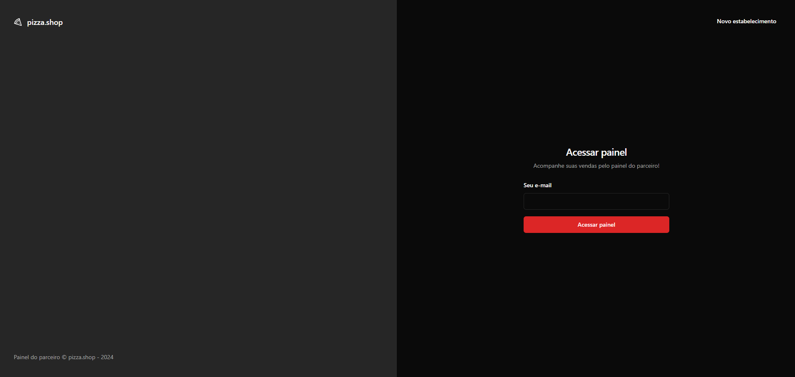

# Pizza Shop

## Descrição

Este projeto foi desenvolvido durante o módulo 04 do curso de ReacjJS da Rocketseat e tem como foco exercitar tanto os conceitos sobre React, quanto a comunicação com APIs via requisição HTTP. O projeto possui testes unitários e end to end. Utiliza Vite, Tipescript, React Router DOM, React Hook Form, shadcn/ui, React Query, Vitest, dentre outros.

### shadcn/ui

Este projeto utiliza **shadcn/ui** (https://ui.shadcn.com/) que é uma biblioteca de componentes pré-estilizados feitos em TailwindCSS. Esses componentes são construídos em cima de outras bibliotecas famosas, como o Radix, o Command Key e o ReactDatePicker. A ideia é que todos os componentes do shadcn/ui sigam o mesmo style guide, tornando-os visualmente semelhantes..

### React Router DOM

O **React Router** (https://reactrouter.com/en/main) é usado para lidar com rotas em aplicações React. Como o React não possui uma funcionalidade de roteamento embutida, precisamos instalar uma biblioteca externa para lidar com isso.

### React Helmet (SEO)

O pugin **React Helmet Async** permite alterar as metatags do React, como o título de cada página. O React Helmet Async é um fork do React Helmet e está mais bem mantido.

### React Hook Form

A biblioteca **react-hook-form** (https://react-hook-form.com/) é utilizada para recuperar os dados dos inputs dos formulários. Esta biblioteca permite trabalhar-mos com os formulários tanto de uma maneira **Controlled** quanto **Uncontrolled**.

A biblioteca **zod** (https://github.com/colinhacks/zod) é utilizada em conjunto com o react-hook-form pora trazer um pouco mais de integração com o TypeScript (IntelliSense).

Para a integração do react-hook-form com bibliotecas de validação, foi necessário usar a biblioteca **@hookform/resolvers**.

### Notificações toast (sonner)

A biblioteca **Sonner** é uma biblioteca de toast pré-estilizada. O Sonner facilita a exibição de mensagens de sucesso ou erro para o usuário.

## Para executar a aplicação

Baixar dependências:

```shell
pnpm i
```

Executar os comandos:

```shell
pnpm run dev
```

OBS: É preciso baixar e rodar o projeto backend seguindo os passos descritos no README:

https://github.com/rocketseat-education/pizzashop-api

## Telas da aplicação

### Sign in



### Sign up


### Dashboards


### Menu do Perfil da Loja


### Edição do Perfil da Loja


### Listagem de Pedidos


### Filtros


### Tema Light

